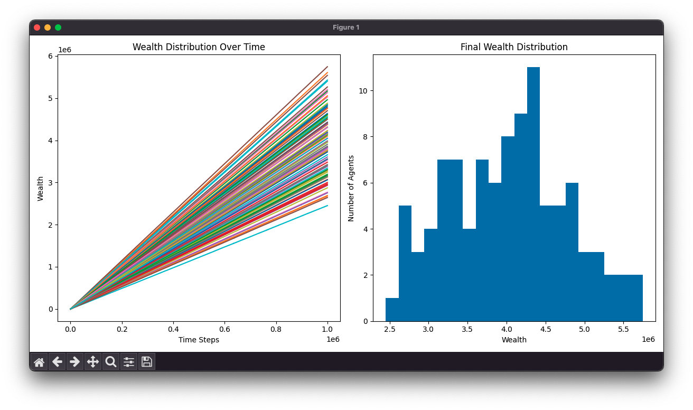

# Wealth Distribution Simulation

This project simulates wealth distribution in a society using an agent-based model. It demonstrates how wealth inequality can emerge from simple rules of work and trade, even when starting from a position of perfect equality.

## Features

- Simulates a society of agents who can work and trade
- Each agent has individual success rates for work and trade
- Visualizes wealth distribution over time
- Calculates and displays the Gini coefficient as a measure of inequality

## Requirements

- Python 3.6+
- NumPy
- Matplotlib

## Installation

1. Clone this repository:
   ```
   git clone https://github.com/yourusername/wealth-distribution-simulation.git
   cd wealth-distribution-simulation
   ```

2. Install the required packages:
   ```
   pip install -r requirements.txt
   ```

## Usage

Run the simulation:

```
python wealth_simulation.py
```

This will run the simulation and display two plots:
1. Wealth distribution over time
2. Final wealth distribution histogram

It will also print the final Gini coefficient.

## Sample Output

Below is a sample output from the simulation:



This plot shows the wealth distribution over time (left) and the final wealth distribution histogram (right). The Gini coefficient provides a measure of inequality in the final state.

## Customization

You can modify the simulation parameters in the `main()` function of `wealth_simulation.py`:

- `num_agents`: Number of agents in the society
- `initial_wealth`: Starting wealth for each agent
- `num_steps`: Number of simulation steps to run

## Contributing

Contributions are welcome! Please feel free to submit a Pull Request.

## License

This project is open source and available under the [MIT License](LICENSE).